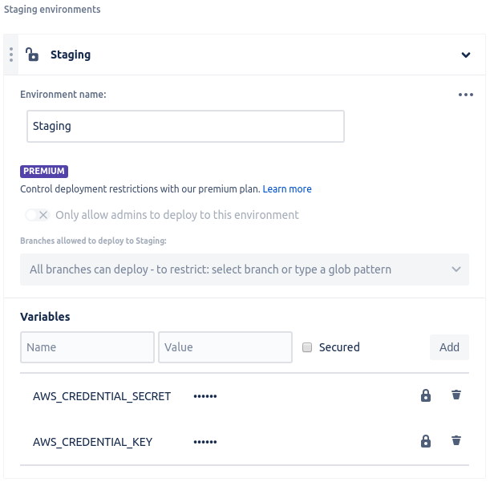
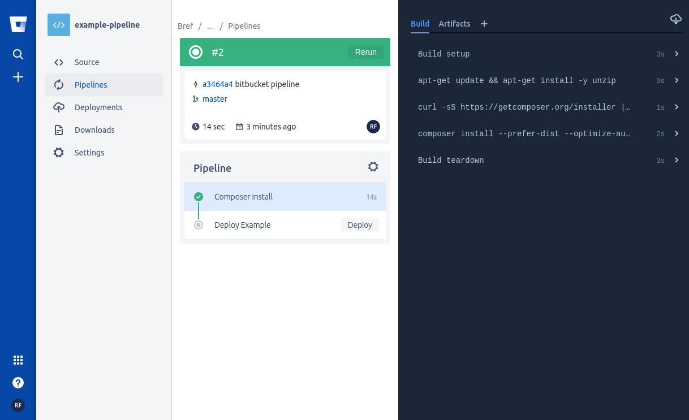
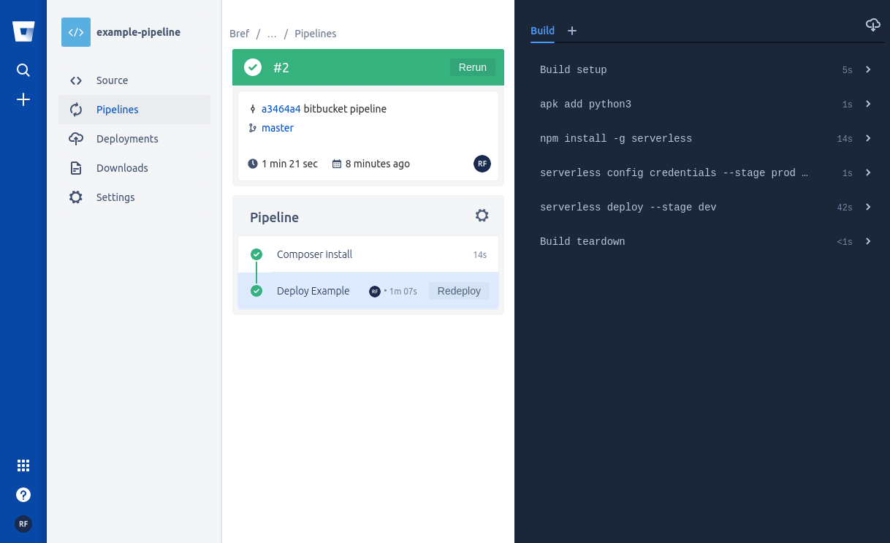

# Requisitos

* Repositório Bitbucket

 
 
* Aplicação configurada para implantar com serverless brefphp

# Passo a Passo

## Configuração Bitbucket

1) Acesse o menu "Settings -> Pipelines -> Settings" e habilite o Pipeline:

 
2) Acesse o menu "Settings -> Pipelines -> Deployments"
- Selecione o ambiente que deseja implantar (Staging ou Production), nesse exemplo vou utilizar o Staging
- Adicione as seguintes váriaveis
  * AWS_CREDENTIAL_KEY: adicione o Access Key ID
  * AWS_CREDENTIAL_SECRET: adicione o Secret Key
  

3) Na raiz do seu projeto crie o arquivo `bitbucket-pipelines.yml`:
```
pipelines:
  branches:
    master: # Sempre que houver um push na branch master
      - step: # 1º passo: usando uma imagem docker php instala o composer e baixa as dependencias do seu projeto
          name: Composer install
          image: php:7.3
          caches:
            - composer
          script:
            - apt-get update && apt-get install -y unzip
            - curl -sS https://getcomposer.org/installer | php -- --install-dir=/usr/local/bin --filename=composer
            - composer install --prefer-dist --optimize-autoloader --no-dev
          artifacts: # os artefatos gerados durante o composer install devem ser passados para o próximo passo
            - vendor/**
            - bootstrap/cache/*.php
      - step:
          # 2º passo: usando a imagem docker node
          #  - instalamos o serverless
          #  - injeta as credenciais utilizando as variaveis configuradas anteriormente
          #  - executa o deploy
          name: Deploy Example
          deployment: staging # ATENÇÃO: aqui é definido quais variáveis de deploy serão injetadas no container de acordo com o environment configurado anteriormente
          image: node:11.13.0-alpine
          trigger: manual
          caches:
            - node
          script:
            - apk add python3
            - npm install -g serverless
            - serverless config credentials --stage prod --provider aws --key ${AWS_DEV_LAMBDA_KEY} --secret ${AWS_DEV_LAMBDA_SECRET}
            - serverless deploy --stage dev
```

# Deploy

* Ao enviar o push para sua branch master automaticamente o pipeline será iniciado
* O primeiro passo será iniciado automaticamente

* Para iniciar o segundo passo é necessário clicar no botão de deploy



# Observações

* Para deixar o segundo passo automático basta retirar o comando `trigger: manual` do arquivo `bitbucket-pipelines.yml`
* No exemplo utilizamos uma imagem docker _php:7.3_ e _node:11.13.0-alpine_, use a imagem que melhor lhe atender.